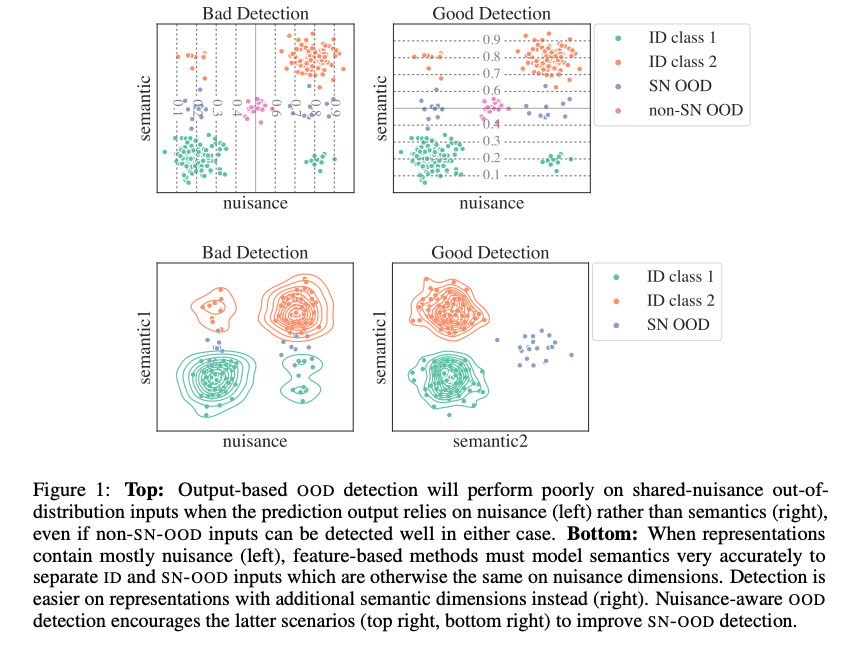

# Robustness to Spurious Correlations Improves Semantic Out-of-distribution Detection

### Overview

### Set Up
All experiments were conducted on CentOS 8.2.2004 with Python 3.8.5 and Pytorch 1.10.2. See `requirements.txt` for further details.

### Data
To begin, first download:
1. [Caltech-UCSD Birds-200-2011](https://vision.cornell.edu/se3/caltech-ucsd-birds-200/)
2. [PlacesBG](http://places2.csail.mit.edu/download.html)
3. [CelebA](http://mmlab.ie.cuhk.edu.hk/projects/CelebA.html)

See `scripts/dataset_creation` for scripts generating Waterbirds in-distribution and shared-nuisance out-of-distribution datasets. Place the data in the location corresponding to `root_dir` or `save_dir` in each of the dataset files. Otherwise, data is downloaded automatically from torchvision in the location specified by `root_dir` or `save_dir`.

### Quickstart
Experiments were run using [Weights and Biases](https://wandb.ai/site). To use, simply create an account, enter your API key locally where experiments will be run, initialize a sweep via `wandb sweep <path/to/config>`, and launch agents via `wandb agent <username/project_name/sweep_id>`. See [Weights and Biases documentation](https://docs.wandb.ai/guides/sweeps/quickstart#4.-launch-agent-s) for further details on sweeps.

